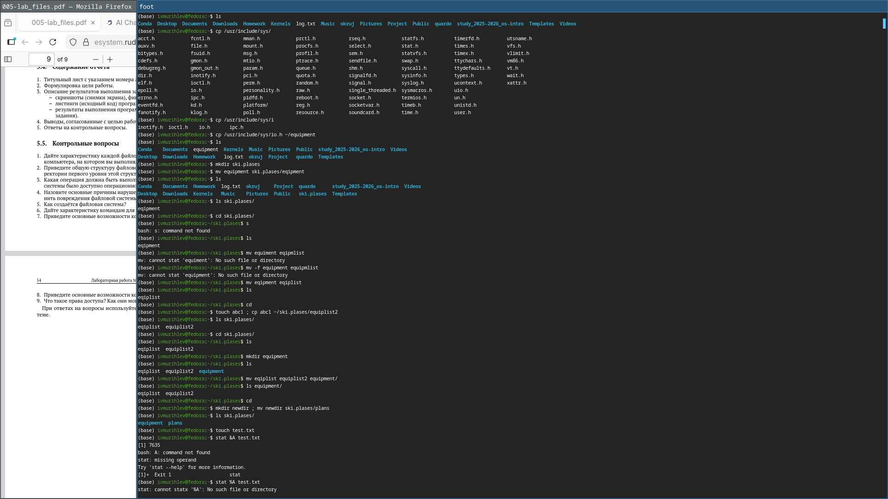
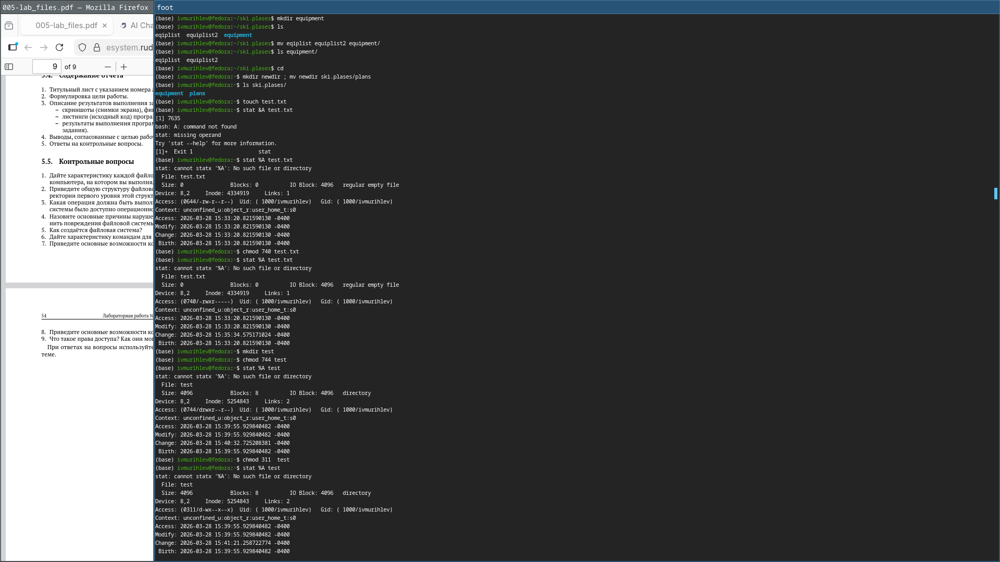
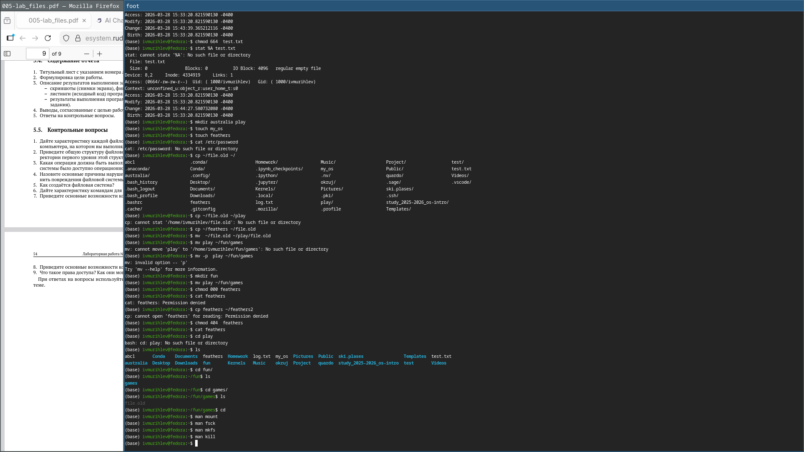

---
author:
  name: Мурылев Иван Валерьевич
  affiliation:
    - name: Российский университет дружбы народов
      country: Российская Федерация
      postal-code: 117198
      city: Москва
      address: ул. Миклухо-Маклая, д. 6

title: "Отчёт по лабораторной работе"
subtitle: "№7"

---

## Цель работы
Ознакомление с файловой системой Linux, её структурой, именами и содержанием
каталогов. Приобретение практических навыков по применению команд для работы
с файлами и каталогами, по управлению процессами (и работами), по проверке исполь-
зования диска и обслуживанию файловой системы.

---

### Выполнение работы
К сожалению скриншоты первого блока повредились. Перемещаем и копируем каталоги

Далее выполняем операции с правами доступа

Затем выполняем четвертый блок. Подробнее в видео.

Пятый блок показан на видео.

---

## Вывод
Файловая система линукс является гибкой и многофункциональной системой, позволяющей работать в группах, не боясь за сохранность тех или иных данных.

---

## Контрольные вопросы
- 1. Дайте характеристику каждой файловой системе, существующей на жёстком диске
компьютера, на котором вы выполняли лабораторную работу.
    У меня одна файловая система, поэтому это она: разделена на ext4 раздел, swap (8 Гб) и файлы загрузки.
- 2. Приведите общую структуру файловой системы и дайте характеристику каждой ди-
ректории первого уровня этой структуры.

- 3. Какая операция должна быть выполнена, чтобы содержимое некоторой файловой
системы было доступно операционной системе?
  chmod

- 4. Назовите основные причины нарушения целостности файловой системы. Как устра-
нить повреждения файловой системы?
На десктопе Linux зачастую устаревание ядра либо повреждения файлов. На прочих — зачастую вирусы. Можно исправить с помощью утилит и восстановления из бэкапа.

- 5. Как создаётся файловая система?
Разделением диска на mount-пойнты, которые отвечают за необходимые для ОС параметры.

- 6. Дайте характеристику командам для просмотра текстовых файлов.
1. cat — выводит содержимое файла.
2. less — постраничный просмотр файла.
3. more — постраничный просмотр.
4. head — выводит первые строки файла.
5. tail — выводит последние строки файла.
6. nl — выводит файл с номерами строк.
Эти команды позволяют просматривать содержимое текстовых файлов удобным способом.

- 7. Приведите основные возможности команды cp в Linux.
Копирование файлов и каталогов с их правами и перемещение с возможностью смены имени.

- 8. Приведите основные возможности команды mv в Linux.
Перемещение файлов и каталогов с их атрибутами и без в разные каталоги.

- 9. Что такое права доступа? Как они могут быть изменены?
Это свойства, которые определяют, какие операции какой пользователь может проводить с данным объектом. Меняются с помощью команды chmod.