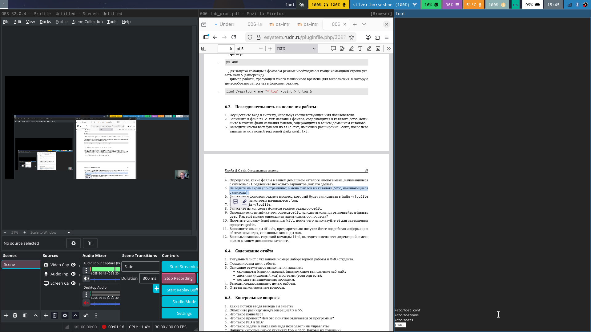
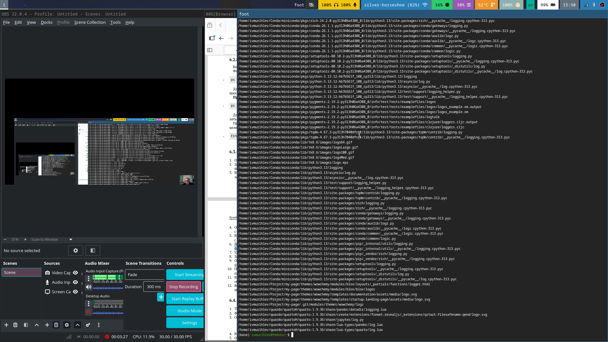

## Title
title: "Лабараторная работа №8"
subtitle: "Мурылев Иван 1032251966 НПИбд-03-25"

---

# Цель работы

Ознакомление с инструментами поиска файлов и фильтрации текстовых данных.
Приобретение практических навыков: по управлению процессами (и заданиями), по
проверке использования диска и обслуживанию файловых систем.

# Выполнение лабораторной работы
К сожалению  забыл сделать скриншоты первых заданий.Есть на видео.
5 задание
{height = 50%  width=70%}
6 задание
{height=60%  width=70%}
7 задание  
Далее на видео.Скриншоты имеют малый масштаб и не разборчивы. 
# Контрольные вопросы
1. Какие потоки ввода вывода вы знаете?  
- Поток ввода (stdin) — стандартный поток для получения данных (обычно клавиатура).  
- Поток вывода (stdout) — стандартный поток для вывода данных (обычно терминал).  
- Поток ошибок (stderr) — стандартный поток для вывода сообщений об ошибках.

2. Объясните разницу между операциями >  и >>.  
- > — перенаправляет вывод в файл, перезаписывая его содержимое.  
- >> — добавляет вывод в конец файла, не удаляя существующее содержимое.

3. Что такое конвейер?  
- Конвейер — это последовательное соединение команд с помощью символа `|`, при котором вывод одной команды становится вводом следующей.

4. Что такое процесс? Чем это понятие отличается от программы?  
- Процесс — это запущенная операция.  
- Программа — это алгоритм  опреации который записан вииде файла.

5. Что такое PID и GID?  
- PID (Process ID) — уникальный идентификатор процесса.  
- GID (Group ID) — идентификатор группы, к которой принадлежит файл или процесс.

6. Что такое задачи и какая команда позволяет ими управлять?  
- Задачи — запущенные процессы.  
- Команда jobs показывает текущие задачи в оболочке, fg переводит задачу на передний план, bg — в фоновый режим, kill — завершает задачу.

7. Найдите информацию об утилитах `top` и `htop`. Каковы их функции?  
- top — отображает в реальном времени информацию о загрузке системы, процессах, памяти.  
- htop — улучшенная версия top с интерактивным интерфейсом, более удобна для управления процессами но все еще нельзя нормально их искать по имени.

8. Назовите и дайте характеристику команде поиска файлов. Приведите примеры использования этой команды.  
- Команда  find ищет файлы по заданным критериям. Например:  
`find ~/ -name "*.txt"` — ищет все файлы с расширением `.txt` в домашнем каталоге.Ну как в лабе  

9. Можно ли по контексту (содержанию) найти файл? Если да, то как?  
- Да, с помощью команды `grep`, которая ищет текст внутри файлов. Например:  
`grep -r "искомая чаисть" ~/` — ищет по содержимому всех файлов в домашнем каталоге.

10. Как определить объем свободной памяти на жёстком диске?  
- Используйте команду `df -h`, которая показывает использование диска в человекочитаемом виде удобном для чтения.

11. Как определить объем вашего домашнего каталога?  
- Команда `du -sh ~` покажет суммарный размер домашнего каталога.

12. Как удалить зависший процесс?  
- Найдите его PID командой `ps` или `top`, затем выполните:  
`kill PID` — для мягкого завершения, или `kill -9 PID` — для принудительного.

# Выводы

Было  изучена система поиска файлов и процессов а также контроль над ними.

