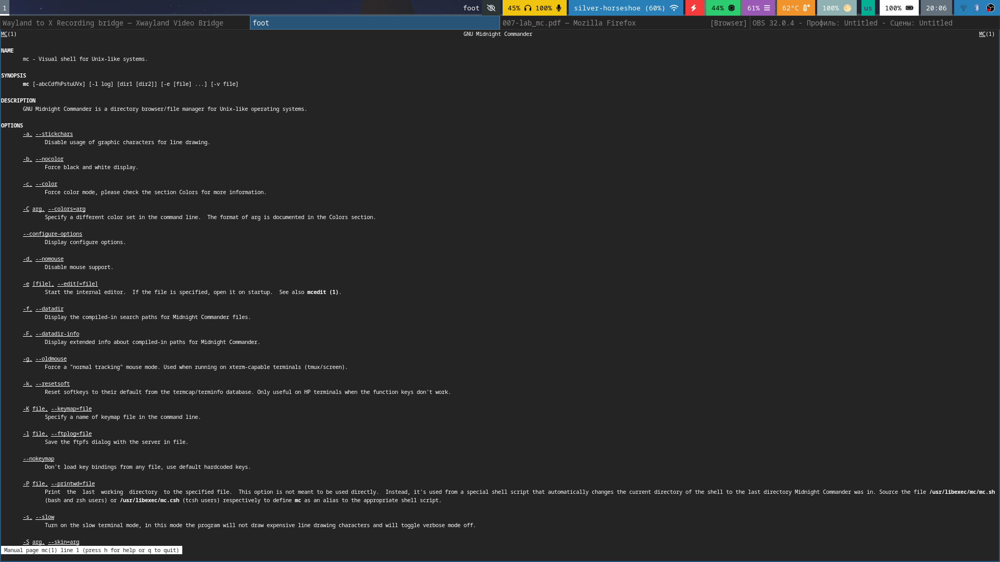
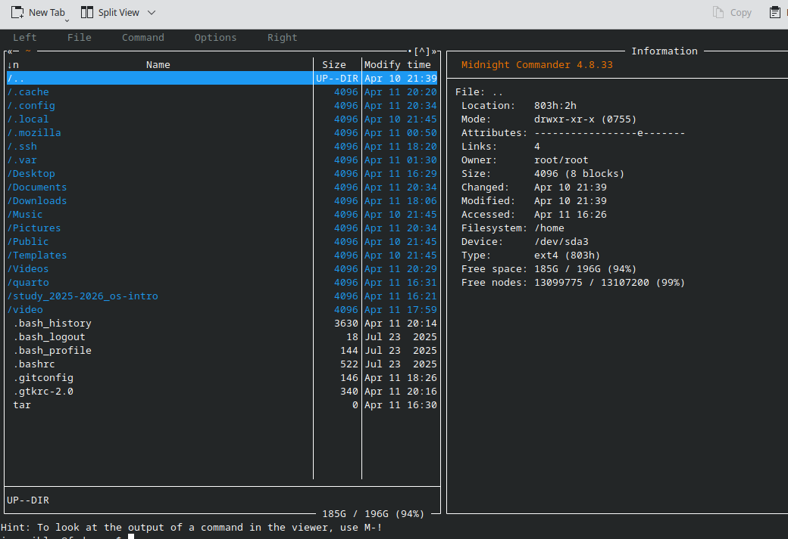
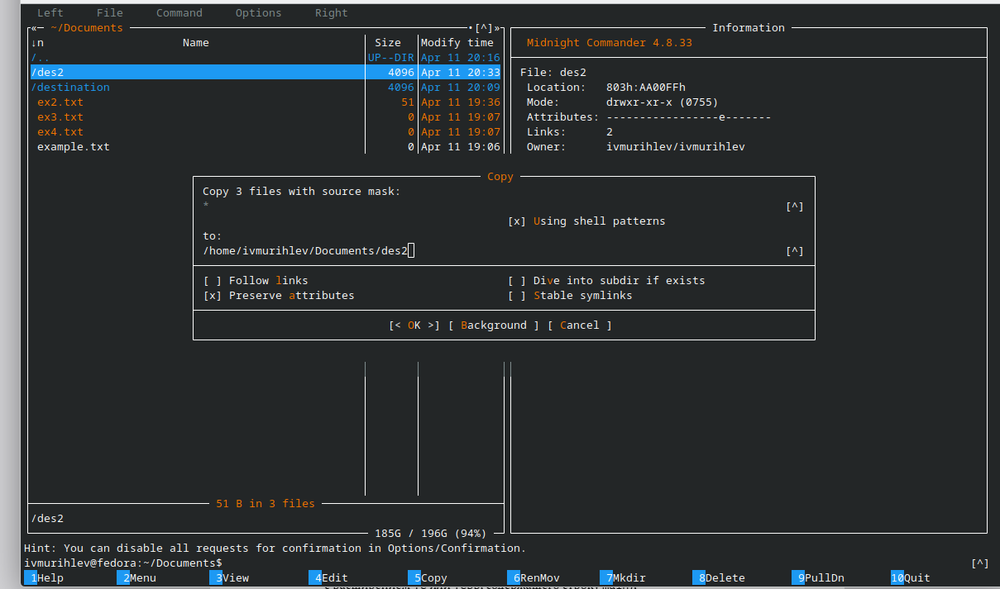
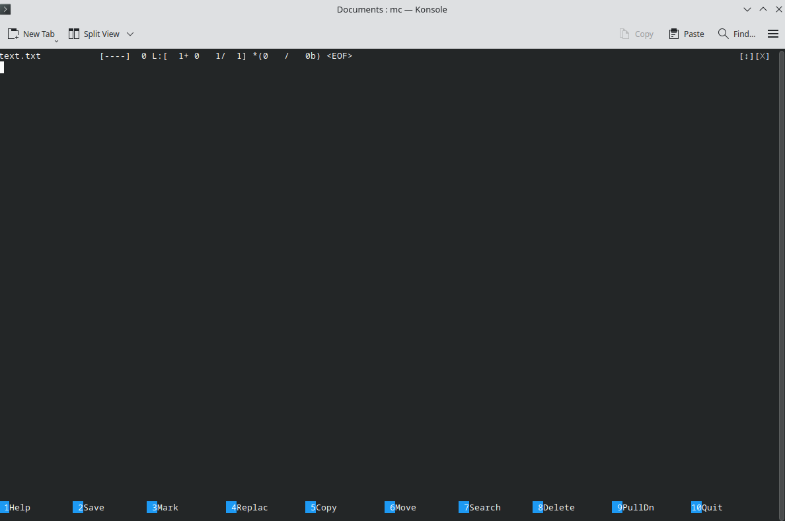
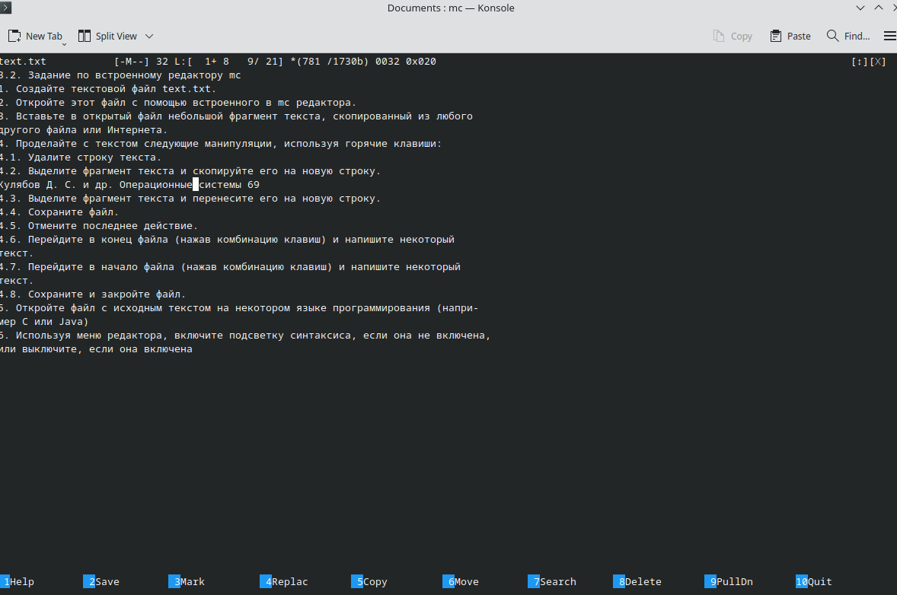

# Цель работы
Освоение основных возможностей командной оболочки Midnight Commander. Приобретение навыков практической работы по просмотру каталогов и файлов; манипуляций
с ними.
# Задание
### Задание по mc
#### 1. Изучите информацию о mc, вызвав в командной строке man mc.
#### 2. Запустите из командной строки mc, изучите его структуру и меню.
#### 3.Выполните несколько операций в mc, используя управляющие клавиши (операции с панелями; выделение/отмена выделения файлов, копирование/перемещение фай- лов, получение информации о размере и правах доступа на файлы и/или каталоги и т.п.)
#### 4. Выполните основные команды меню левой (или правой) панели. Оцените степень
подробности вывода информации о файлах.
#### 5. Используя возможности подменю Файл , выполните:
1. просмотр содержимого текстового файла;
2. редактирование содержимого текстового файла (без сохранения результатов редактирования);
3. создание каталога;
4. копирование в файлов в созданный каталог.
#### 6. С помощью соответствующих средств подменю Команда осуществи
1. поиск в файловой системе файла с заданными условиями (например, файла с расширением .c или .cpp, содержащего строку main);
2. выбор и повторение одной из предыдущих команд;
3. переход в домашний каталог;
4. анализ файла меню и файла расширений.
### 7. Вызовите подменю Настройки . Освойте операции, определяющие структуру экрана mc
(Full screen, Double Width, Show Hidden Files и т.д.)
### Задание по встроенному редактору mc
1. Создайте текстовой файл text.txt.
2. Откройте этот файл с помощью встроенного в mc редактора.
3. Вставьте в открытый файл небольшой фрагмент текста, скопированный из любого другого файла или Интернета.
### 4. Проделайте с текстом следующие манипуляции, используя горячие клавиши:
1. Удалите строку текста.
2. Выделите фрагмент текста и скопируйте его на новую строку
3. Выделите фрагмент текста и перенесите его на новую строку.
4. Сохраните файл.
5. Отмените последнее действие.
6. Перейдите в конец файла (нажав комбинацию клавиш) и напишите некоторый текст.
7. Перейдите в начало файла (нажав комбинацию клавиш) и напишите некоторый текст.
8. Сохраните и закройте файл.
### 5. Откройте файл с исходным текстом на некотором языке программирования (например C или Java)
### 6. Используя меню редактора, включите подсветку синтаксиса, если она не включена,или выключите, если она включена.
# Теоретическое введение
1. Командная оболочка — интерфейс взаимодействия пользователя с операционной системой и программным обеспечением посредством команд.
2. Midnight Commander (или mc) — псевдографическая командная оболочка для UNIX/Linux систем. Для запуска mc необходимо в командной строке набрать mc и нажать Enter.
3. Панель в mc отображает список файлов текущего каталога. Абсолютный путь к этому каталогу отображается в заголовке панели. У активной панели заголовок и одна из её строк подсвечиваются. Управление панелями осуществляется с помощью определённых комбинаций клавиш или пунктов меню mc
#### 1.Команды меню Файл :
1. Просмотр ( F3 ) — позволяет посмотреть содержимое текущего (или выделенного) файла без возможности редактирования.
2.  Просмотр вывода команды ( М + ! ) — функция запроса команды с параметрами (аргумент к текущему выбранному файлу).
3. Правка ( F4 ) — открывает текущий (или выделенный) файл для его редактирования.
4. Копирование ( F5 ) — осуществляет копирование одного или нескольких файлов или каталогов в указанное пользователем во всплывающем окне место.
5. Права доступа ( Ctrl-x c ) — позволяет указать (изменить) права доступа к одному или нескольким файлам или каталогам 
6. Жёсткая ссылка ( Ctrl-x l ) — позволяет создать жёсткую ссылку к текущему (иливыделенному) файлу1.
7. Символическая ссылка ( Ctrl-x s ) — позволяет создать символическую ссылку к теку щему (или выделенному) файлу2.
8. Владелец/группа ( Ctrl-x o ) — позволяет задать (изменить) владельца и имя группы для одного или нескольких файлов или каталогов.
9. Права (расширенные) — позволяет изменить права доступа и владения для одного или нескольких файлов или каталогов.
10. Переименование ( F6 ) — позволяет переименовать (или переместить) один или несколько файлов или каталогов.
11. Создание каталога ( F7 ) — позволяет создать каталог.
12. Удалить ( F8 ) — позволяет удалить один или несколько файлов или каталогов.
13. Выход ( F10 ) — завершает работу mc.
#### 2.Меню Команда:
1. Переставить панели — меняет местами левую и правую панели.
2. Сравнить каталоги ( Ctrl-x d ) — сравнивает содержимое двух каталогов.
3. Размеры каталогов — отображает размер и время изменения каталога (по умолчанию в mc размер каталога корректно не отображается).
4. История командной строки — выводит на экран список ранее выполненных в оболочке команд.
5. Каталоги быстрого доступа ( Ctrl-\ ) — пр вызове выполняется быстрая смена текущего каталога на один из заданного списка.
6. Восстановление файлов — позволяет восстановить файлы на файловых системах ext2 и ext3.
7. Редактировать файл расширений — позволяет задать с помощью определённого синтаксиса действия при запуске файлов с определённым расширением (например, какое программного обеспечение запускать для открытия или редактирования файлов с расширением doc или docx).
8. Редактировать файл меню — позволяет отредактировать контекстное меню пользователя, вызываемое по клавише F2.
9. Редактировать файл расцветки имён — позволяет подобрать оптимальную для пользователя расцветку имён файлов в зависимости от их типа.
# Выполнение лабораторной работы
### В редакторе файлов mc.
1. Просмотр команды  man.

2. 
2-ую задачу не имеет смысл расписывать так как все указано в теоретической части. 3яя указана на видео.Получилось бы слишком много скриншотов. Смотрим характеристики файла вроде прав доступа,содержания и тп.

Далее копируем все файлы.
 
### В встроенном редакторе.
После создания файла открываем его в редакторе.

Затем вставлем текст

Дальнейшие задания представленны в видео ,так как  демонстрируют работу, которую долго описывать здесь.
7 ctr + s - включение и выключение подсветки синтаксиса. 

# Выводы
Midnight commander предоставляет большой набор инструментов для работы с ОС и оптимизации процессов навигации и поиска.   
# Контрольные вопросы
1. Режимы работы в mc:
    - Интерфейс командной строки — управление с помощью команд в терминале.
    - Графический режим — графический интерфейс с двумя панелями и меню.
    - Режим командной строки внутри mc — для выполнения команд напрямую.

2. Операции с файлами, доступные через команды shell и меню:
    - Копирование файла (`F5` в меню или команда `cp`).
    - Удаление файла (`F8`).
    - Переименование (`F6`).
    - Создание новой папки (`F7`)

3. Структура меню левой (или правой) панели:
    - Обычно содержит отображение файлов и папок.
    - Можно настраивать отображение, фильтры, сортировку.
    - Команды позволяют управлять файлами (копировать, перемещать, удалять).
4. Меню "Файл":
    - Включает команды: Создать файл, Открыть, Сохранить, Выход.
    - Управление файлами и настройками открытия/сохранения.
5. Меню "Команда":
    - Выполнение системных команд, запуск скриптов.
    - Вставка команд, вызов внешних утилит.

6. Меню "Настройки":
    - Настройка внешнего вида, панели, цветовой схемы.
    - Конфигурация поведения mc.

7. Встроенные команды mc:
    - Навигация по файлам 
    - Обновление отображения..
    - Быстрый доступ к панели и меню.
8. Команды встроенного редактора mc:
    - Вставка текста.
    - Режим поиска.
    - Отмена изменений.
9. Средства для создания пользовательских меню:
    - Используются файлы конфигурации
    - Позволяют создавать свои пункты меню для быстрого доступа.
10. Средства для выполнения действий над файлом:
    - Быстрые команды для копирования, перемещения, удаления.
    - Контекстное меню и горячие клавиши
