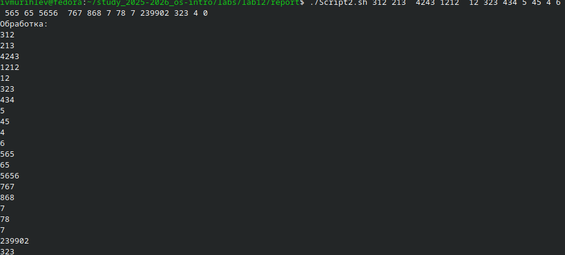
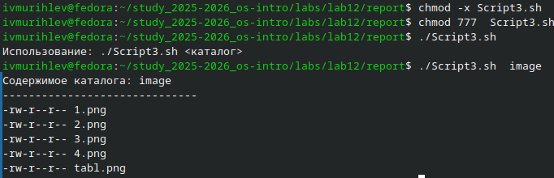
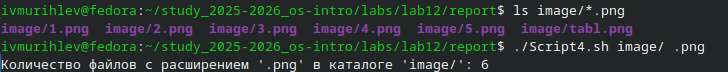

---
## Author
author:
  name: Мурылев Иван Валерьевич НПИбд-03-25
  
  affiliation:
    - name: Российский университет дружбы народов
      country: Российская Федерация
      postal-code: 117198
      city: Москва
      address: ул. Миклухо-Маклая, д. 6

## Title
title: "Отчёт по лабораторной работе"
subtitle: "№12"

---

# Цель работы
Изучить основы программирования в оболочке ОС UNIX/Linux. Научиться писать
небольшие командные файлы.
# Задание
1. Написать скрипт, который при запуске будет делать резервную копию самого себя (то
есть файла, в котором содержится его исходный код) в другую директорию backup
в вашем домашнем каталоге. При этом файл должен архивироваться одним из ар-
хиваторов на выбор zip, bzip2 или tar. Способ использования команд архивации
необходимо узнать, изучив справку.
2. Написать пример командного файла, обрабатывающего любое произвольное число
аргументов командной строки, в том числе превышающее десять. Например, скрипт
может последовательно распечатывать значения всех переданных аргументов.
3. Написать командный файл — аналог команды ls (без использования самой этой ко-
манды и команды dir). Требуется, чтобы он выдавал информацию о нужном каталоге
и выводил информацию о возможностях доступа к файлам этого каталога.
4. Написать командный файл, который получает в качестве аргумента командной строки
формат файла (.txt, .doc, .jpg, .pdf и т.д.) и вычисляет количество таких файлов
в указанной директории. Путь к директории также передаётся в виде аргумента ко-
мандной строки.
# Теоретическое введение
## Командные процессоры
Командный процессор (командная оболочка, интерпретатор команд shell) — это программа, позволяющая пользователю взаимодействовать с операционной системой компьютера. В операционных системах типа UNIX/Linux наиболее часто используются следующие реализации командных оболочек:
- оболочка Борна (Bourne shell или sh) — стандартная командная оболочка UNIX/Linux, содержащая базовый, но при этом полный набор функций;
- С-оболочка (или csh) — надстройка на оболочкой Борна, использующая С-подобный синтаксис команд с возможностью сохранения истории выполнения команд;
-  оболочка Корна (или ksh) — напоминает оболочку С, но операторы управления программой совместимы с операторами оболочки Борна;
- BASH — сокращение от Bourne Again Shell (опять оболочка Борна), в основе своей совмещает свойства оболочек С и Корна (разработка компании Free Software Foundation).
POSIX (Portable Operating System Interface for Computer Environments) — набор стандартов
описания интерфейсов взаимодействия операционной системы и прикладных программ.
Стандарты POSIX разработаны комитетом IEEE (Institute of Electrical and Electronics
Engineers) для обеспечения совместимости различных UNIX/Linux-подобных операционных систем и переносимости прикладных программ на уровне исходного кода.
POSIX-совместимые оболочки разработаны на базе оболочки Корна.
Рассмотрим основные элементы программирования в оболочке bash. В других оболочках большинство команд будет совпадать с описанными ниже.
## Метасимволы и их экранирование
При перечислении имён файлов текущего каталога можно использовать следующие символы:
- * — соответствует произвольной, в том числе и пустой строке;
- ? — соответствует любому одинарному символу;
- [c1-c1] — соответствует любому символу, лексикографически находящемуся между символами c1 и с2.
- echo * — выведет имена всех файлов текущего каталога, что представляет собой простейший аналог команды ls;
- ls *.c — выведет все файлы с последними двумя символами, совпадающими с .c.
- echo prog.? — выведет все файлы, состоящие из пяти или шести символов, первыми пятью символами которых являются prog..
– [a-z]* — соответствует произвольному имени файла в текущем каталоге, начинающемуся с любой строчной буквы латинского алфавита.
Такие символы, как ' < > * ? | \ " &, являются метасимволами и имеют для командного процессора специальный смысл. Снятие специального смысла с метасимвола
называется экранированием метасимвола. Экранирование может быть осуществлено с помощью предшествующего метасимволу символа \, который, в свою очередь, является метасимволом.
Для экранирования группы метасимволов нужно заключить её в одинарные кавыч-
ки. Строка, заключённая в двойные кавычки, экранирует все метасимволы, кроме
$, ' , \, ". Например,
- echo \* выведет на экран символ *,
-  echo ab’*\|*’cd выведет на экран строку ab*\|*cd
## Использование команды getopts
Весьма необходимой при программировании является команда getopts, которая осу-
ществляет синтаксический анализ командной строки, выделяя флаги, и используется
для объявления переменных. Синтаксис команды следующий:
``` bash
getops option-string variable [arg.....]
```
**Флаги** — это опции командной строки, обычно помеченные знаком минус; Например,
для команды ls флагом может являться -F. Иногда флаги имеют аргументы, связанные
с ними. Программы интерпретируют флаги, соответствующим образом изменяя своё
поведение.
Строка опций option-string — это список возможных букв и чисел соответствующего
флага. Если ожидается, что некоторый флаг будет сопровождаться некоторым аргументом,
то за символом, обозначающим этот флаг, должно следовать двоеточие. Соответству-
ющей переменной присваивается буква данной опции. Если команда getopts может
распознать аргумент, то она возвращает истину. Принято включать getopts в цикл while
и анализировать введённые данные с помощью оператора case
# Выполнение лабораторной работы
## 1.
После создания файла Script1 заполняем его следующим содержанием.
##### Листинг Script1
```bash
#!/bin/bash
# Определяем путь
SCRIPT_PATH="$(realpath "$0")"

# Создаем директорию backup в домашнем каталоге, если не существует
BACKUP_DIR="$HOME/backup"
mkdir -p "$BACKUP_DIR"
echo "Выберите способ архивации:"
echo "1. zip"
echo "2. bzip2"
echo "3. tar"
read -p "Введите номер выбранного варианта (1-3): " choice

# Имя файла резервной копии 
BASENAME="$(basename "$SCRIPT_PATH")"
TIMESTAMP=$(date +"%Y%m%d_%H%M%S")
BACKUP_FILE="$BACKUP_DIR/${BASENAME%.sh}_$TIMESTAMP"
case "$choice" in
  1)
    # Архивация zip
    cp "$SCRIPT_PATH" "$BACKUP_FILE.sh"
    zip "$BACKUP_FILE.zip" "$BACKUP_FILE.sh"
    rm "$BACKUP_FILE.sh"
    echo "Резервная копия создана: $BACKUP_FILE.zip"
    ;;
  2)
    # Архивация bzip2
    cp "$SCRIPT_PATH" "$BACKUP_FILE.bak"
    bzip2 "$BACKUP_FILE.bak"
    mv "$BACKUP_FILE.bak.bz2" "$BACKUP_FILE.bz2"
    echo "Резервная копия создана: $BACKUP_FILE.bz2"
    ;;
  3)
    # Архивация tar
    cp "$SCRIPT_PATH" "$BACKUP_FILE.sh"
    tar -cf "$BACKUP_FILE.tar" "$BACKUP_FILE.sh"
    rm "$BACKUP_FILE.sh"
    echo "Резервная копия создана: $BACKUP_FILE.tar"
    ;;
  *)
    echo "Некорректный выбор. Скрипт завершен."
    exit 1
    ;;
esac
```
## 2
Создаем файл Script2.sh и вносим в него следующий код.
``` bash 
#!/bin/bash

# Проверка наличия 
if [ "$#" -eq 0 ]; then
  echo "Передано не было аргументов."
  exit 0
fi

echo "Обработка:"
for arg in "$@"
do
  echo "$arg"
```
После запускаем и проверяем.


## 3 
Создаем файл Script3.sh и вносим в него следующий код.
``` bash 
#!/bin/bash

# Проверка, что передан каталог
if [ "$#" -ne 1 ]; then
  echo "Использование: $0 <каталог>"
  exit 1
fi

directory=$1

# Проверка, что каталог существует
if [ ! -d "$directory" ]; then
  echo "Каталог не найден: $directory"
  exit 1
fi

echo "Содержимое каталога: $directory"
echo "------------------------------"

# Перебор файлов и папок в каталоге
for item in "$directory"/*
do
  # Проверка, что файл существует
  if [ -e "$item" ]; then
    # Получение прав доступа
    permissions=$(stat -c %A "$item")
    # Получение имени файла или папки
    name=$(basename "$item")
    echo "$permissions $name"
  fi
done


```


## 4
Создаем файл Script4.sh и вносим в него следующий код.
``` bash
#!/bin/bash

# Проверка аргументов
if [ "$#" -ne 2 ]; then
  echo "Использование: $0 <директория> <расширение>"
  exit 1
fi

directory=$1
extension=$2

# Проверка существования директории
if [ ! -d "$directory" ]; then
  echo "Каталог не найден: $directory"
  exit 1
fi

# Подсчет файлов с данным расширением
count=$(find "$directory" -type f -name "*$extension" | wc -l)

echo "Количество файлов с расширением '$extension' в каталоге '$directory': $count"
```


# Контрольные вопросы

1. **Объясните понятие командной оболочки. Приведите примеры командных оболочек. Чем они отличаются?**  
   - Командная оболочка — это программа, которая интерпретирует команды пользователя и управляет выполнением программ и скриптов.  
   - Примеры: `bash`, `sh`, `zsh`, `ksh`, `csh`.  
   - Отличия: синтаксис команд, поддержка функций, наличие расширенных возможностей, совместимость с POSIX и др.

2. **Что такое POSIX?**  
   - POSIX (Portable Operating System Interface) — стандарт, определяющий интерфейсы операционных систем для обеспечения совместимости программ.

3. **Как определяются переменные и массивы в языке программирования bash?**  
   - Переменные: `variable_name=value` (без пробелов).  
   - Массивы: `array_name=(elem1 elem2 ...); доступ: ${array_name[index]}`.

4. **Каково назначение операторов let и read?**  
   - `let` — используется для выполнения арифметических выражений.  
   - `read` — для ввода данных с клавиатуры и присвоения их переменным.

5. **Какие арифметические операции можно применять в языке программирования bash?**  
   - Сложение (+), вычитание (-), умножение (*), деление (/), остаток от деления (%), инкремент (++), декремент (--).

6. **Что означает операция (( ))?**  
   - Операция `(( ))` — арифметический контекст, позволяет выполнять арифметические выражения.

7. **Какие стандартные имена переменных Вам известны?**  
   - `$HOME`, `$PATH`, `$USER`, `$PWD`, `$0`, `$?`, `$#`, `$*`, `$@`.

8. **Что такое метасимволы?**  
   - Метасимволы — специальные символы, имеющие особое значение в командных оболочках, например: `*`, `?`, `[ ]`, `|`, `&`, `;`.

9. **Как экранировать метасимволы?**  
   - Экранирование — добавление обратного слэша `\` перед метасимволом, например: `\*`, `\?`.

10. **Как создавать и запускать командные файлы?**  
    - Создавать файл с расширением `.sh`, писать команды, сделать его исполняемым (`chmod +x filename.sh`) и запускать (`./filename.sh`).
10. **Как со